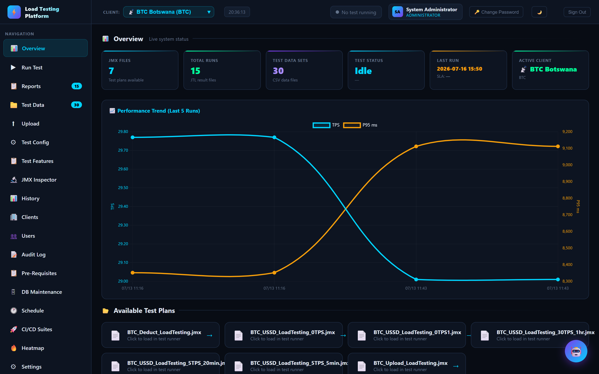
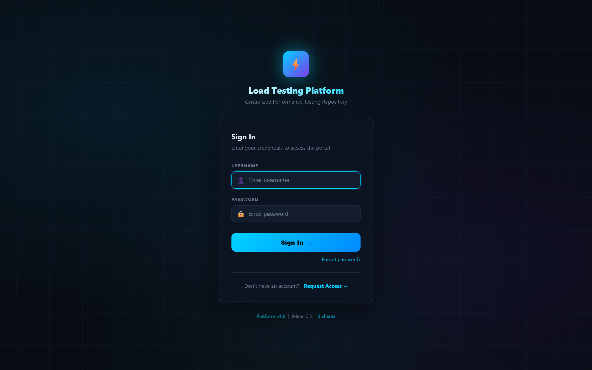
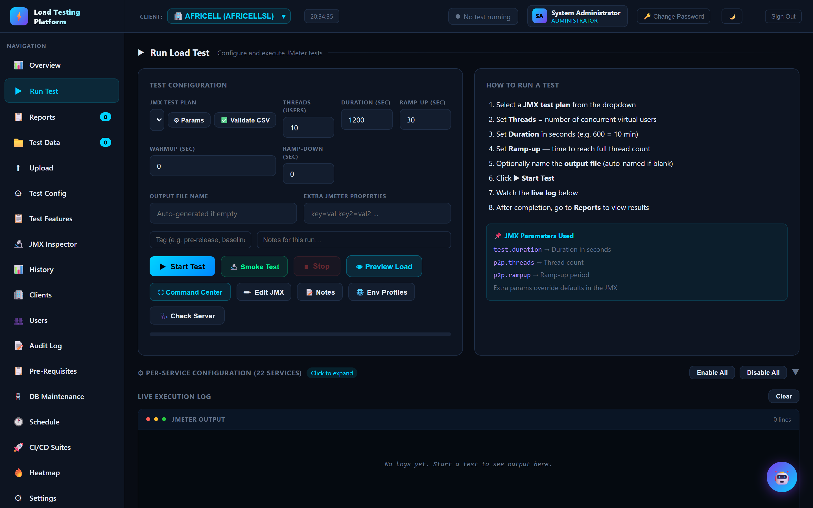
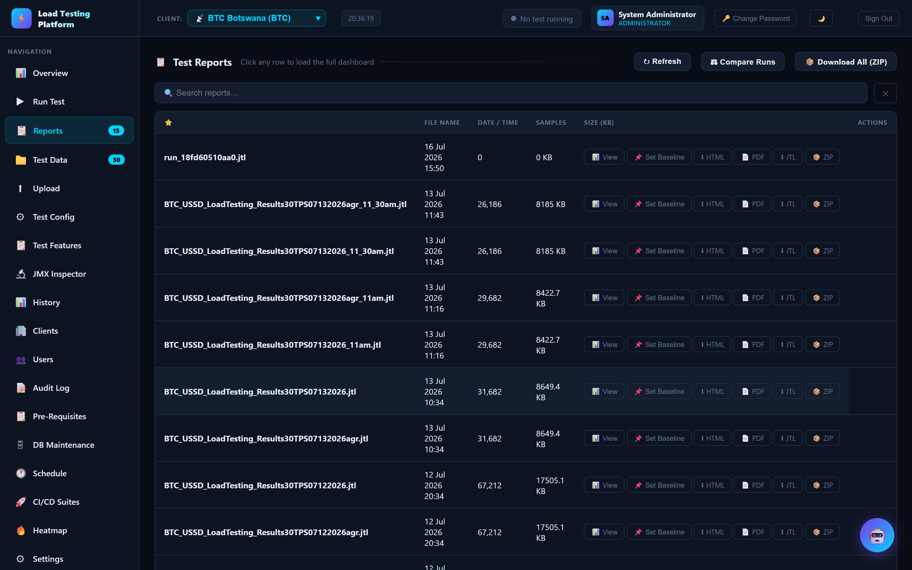
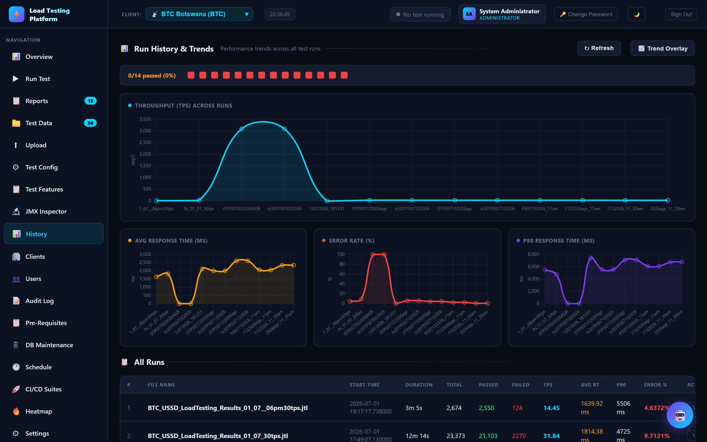
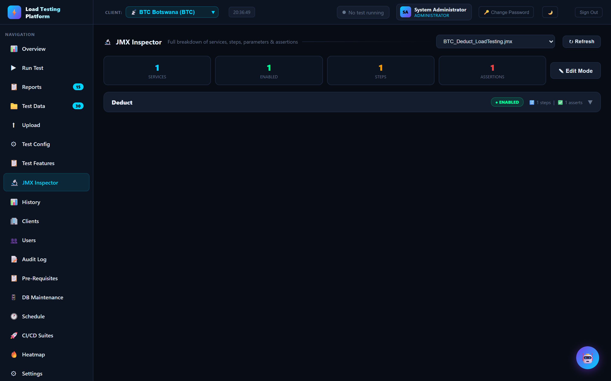
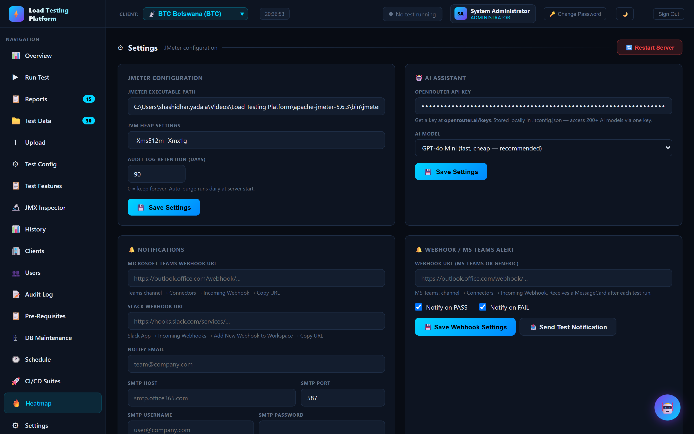

# Load Testing Platform

A centralized, multi‑client performance‑testing portal built on top of **Apache JMeter**. It turns a folder of `.jmx` scripts and CSV data into a full web application for **running load tests, watching them live, and analysing the results** — without anyone touching the JMeter GUI or a command line.

The whole platform is a single Flask app (`app.py`) backed by SQLite. It self‑installs its Python dependencies on first run and ships with JMeter bundled, so a fresh machine goes from clone to running tests in one command.



---

## Why this exists

Running JMeter across several clients and environments usually means scattered `.jmx` files, ad‑hoc command lines, JTL results nobody can read, and no shared history. This platform solves that by giving one team a single place to:

- **Keep every client isolated** — each client has its own JMX plans, test data, and reports; switch between them from a dropdown.
- **Run tests without JMeter expertise** — pick a plan, set threads/duration/ramp‑up, click **Start**. No GUI, no CLI.
- **See results as they happen** — live TPS, response times, errors, and a request/response tree stream into the browser while the test runs.
- **Make results shareable and durable** — every run is stored with its metrics, so history, trends, baselines, and side‑by‑side comparisons are always available.
- **Wire performance into CI/CD** — Jenkins (or any pipeline) can trigger suites over a token‑authenticated API and get a pass/fail **release gate** back based on SLAs, baselines, and thresholds.
- **Control access** — role‑based logins (admin / viewer), full audit log, and per‑action attribution.

---

## What you get

| Area | Highlights |
|------|-----------|
| **Multi‑client** | Isolated `jmx/`, `testdata/`, and `reports/` per client; add clients from the UI |
| **Run Test** | Threads / duration / ramp‑up / warm‑up / ramp‑down, per‑service enable‑disable, CSV validation, smoke test, load preview |
| **Live monitoring** | Live TPS / latency / error stats, virtual‑user log, request/response results tree, auto‑stop on error % |
| **Reports** | JTL parsing with percentiles, TPS & error charts; export **HTML, PDF, Excel, JTL, ZIP bundle** |
| **History & Trends** | All runs in one table; throughput / response‑time / error‑rate trend charts; compare runs; baselines & regression checks |
| **JMX Inspector** | Browse services, steps, parameters and assertions inside a plan; edit parameters in place |
| **CI/CD** | Test suites, token‑authenticated API for Jenkins, SLA/baseline/threshold **release gates** (pass/fail) |
| **Scheduling** | One‑off and recurring schedules, calendar & heatmap views |
| **Health Monitor** | Endpoint checks, system stats, pre‑test sanity checks |
| **Integrations** | Teams / Slack webhooks, SMTP email report distribution, optional AI narrative / RCA (OpenRouter) |
| **Admin** | Users & roles, self‑registration approvals, audit log, DB maintenance (vacuum / purge / backup / export) |

---

## Requirements

- **Python 3.9+**
- **Apache JMeter 5.5+** — a copy of **5.6.3 is bundled** in `apache-jmeter-5.6.3/` and used by default
- **Java 8+** (required by JMeter)
- Windows 10/11 (developed and run on Windows; the batch launchers are Windows‑specific)

Python packages are minimal (`flask`, `openpyxl`, plus `werkzeug`/`psutil`) and are **auto‑installed on first run** — see `requirements.txt`.

---

## Quick start

```bash
# 1. (optional) install dependencies up front — otherwise app.py installs them itself
pip install -r requirements.txt

# 2. Start the server — double-click, or run from a terminal
start_server.bat          # or:  python app.py

# 3. Open the portal
http://localhost:5000
```



### Credentials

On the **first run against an empty database**, an `admin` and a `viewer` account are seeded. Set the passwords explicitly with environment variables; if you don't, a random password is generated and **printed to the console** at startup.

```bash
set LT_ADMIN_USER=admin
set LT_ADMIN_PASS=<choose-a-strong-password>
set LT_VIEWER_USER=viewer
set LT_VIEWER_PASS=<choose-a-strong-password>
```

| Role | Default username | Access |
|------|------------------|--------|
| Admin  | `admin`  | Full portal (all panels below) |
| Viewer | `viewer` | Read‑only viewer portal + run tests |

> **Change these immediately after first login** via the **Users** panel. This repository ships with a pre‑seeded database for convenience — treat it as non‑production.

If a password is lost, an admin can reset it from **Users**. If the admin password itself is unknown, reset it directly in the DB (use Werkzeug hashing — plain `hashlib.sha256` will fail login):

```bash
python -c "from werkzeug.security import generate_password_hash; import sqlite3, getpass; \
pw=getpass.getpass('New admin password: '); db=sqlite3.connect('lt_platform.db'); \
db.execute(\"UPDATE users SET password=? WHERE username='admin'\", (generate_password_hash(pw),)); \
db.commit(); db.close(); print('Password updated.')"
```

Run it from the project root while the server is stopped.

---

## How to run a load test



1. Pick the **client** (top bar) and a **JMX test plan**.
2. Set **Threads** (virtual users), **Duration**, and **Ramp‑up** (plus optional warm‑up / ramp‑down).
3. Optionally **Validate CSV**, adjust **per‑service** enable/disable, or **Preview Load**.
4. Click **▶ Start Test** and watch the **live execution log** and stats.
5. When it finishes, open **Reports** for the full dashboard, or **History** for trends.

JMX properties like `test.duration`, `<service>.threads`, and `<service>.rampup` are driven by the form; extra `key=val` properties override plan defaults.

---

## Reading the results

**Reports** lists every JTL with sample counts and size, and gives one‑click exports (View dashboard, HTML, PDF, JTL, ZIP). Set any run as a **baseline** to compare future runs against it.



**History & Trends** charts throughput, response time, and error rate across all runs, with a per‑run table (passed/failed, TPS, avg RT, P90, error %) and pass/fail indicators.



**JMX Inspector** breaks a plan down into services, steps, parameters, and assertions — and lets you edit parameters without opening JMeter.



**Settings** is where JMeter path/heap, webhooks, SMTP email, AI, and **CI/CD API tokens** are configured.



---

## Project structure

```
Load Testing Platform/
├── app.py                    # Flask application — the entire backend + API (v4.0)
├── requirements.txt          # Python dependencies (auto-installed on first run)
├── start_server.bat / START.bat   # Windows launchers
├── apache-jmeter-5.6.3/      # Bundled JMeter (used by default)
├── templates/                # login.html, admin.html, viewer.html, prereq.html
├── static/                   # Front-end assets (chart.min.js)
├── tools/                    # jtl_to_html_report.py — standalone JTL → HTML report
├── scripts/                  # Sample-client setup & E2E smoke tests
├── docs/screenshots/         # Screenshots used in this README
└── clients/                  # One folder per client (auto-created)
    └── <CLIENT_CODE>/
        ├── jmx/              # JMeter test plans (.jmx)
        ├── testdata/         # CSV data files
        └── reports/          # JTL results + generated HTML reports
```

Generated on first run (not committed):

- `lt_platform.db` — SQLite database (users, clients, runs, audit log)
- `.ltconfig.json` — JMeter path, heap, and integration settings
- `.lt_secret` — persistent Flask session key

---

## Adding a new client

1. Log in as admin → **Clients** → **New Client**.
2. Enter a client code (e.g. `MTN`), a name, and optional custom directory paths.
3. Drop JMX files into `clients/<CODE>/jmx/` and CSV data into `clients/<CODE>/testdata/` (or use the **Upload** panel).

---

## Configuration

Settings live in `.ltconfig.json` (editable from the **Settings** panel) and can be overridden with environment variables — see `.env.example`.

```json
{
  "jmeter_bin": "…/apache-jmeter-5.6.3/bin/jmeter.bat",
  "heap": "-Xms512m -Xmx1g",
  "audit_retention_days": 90,
  "session_timeout_mins": 120,
  "auto_stop_err_pct": 0
}
```

Common environment variables:

| Variable | Purpose |
|----------|---------|
| `LT_SECRET_KEY` | Flask session key (persist sessions across restarts) |
| `LT_ADMIN_USER` / `LT_ADMIN_PASS` | Seed the admin account on first run |
| `LT_VIEWER_USER` / `LT_VIEWER_PASS` | Seed the viewer account on first run |
| `LT_FORCE_SECURE_COOKIES` | Set `1` behind HTTPS to add the Secure cookie flag |
| `LT_WEBHOOK_SKIP_TLS` | Set `1` only for self‑signed webhook endpoints |

> **Security note:** `.ltconfig.json` can hold secrets (API keys, SMTP passwords). Keep it out of any shared/public repo and rotate anything that has been committed.

---

## CI/CD integration

CI/CD suites run real JMeter executions and return a **release gate** (`pass`/`fail`) evaluated against SLAs, baselines, and thresholds — so a pipeline can block a release on performance regressions.

- Create suites and manage **API tokens** in **Settings**.
- Jenkins (or any client) authenticates with a Bearer token and triggers runs via the CI/CD API.
- See `CI_CD_API_GUIDE.md`, `CI_CD_ARCHITECTURE.md`, and `Jenkinsfile.example` for the full contract and a working pipeline.

---

## End‑to‑end testing

A local sample client and a smoke suite ship with the repo:

```bash
python scripts/sample_client_setup.py     # idempotent — creates the SAMPLE client fixture
python scripts/e2e_smoke_test.py           # validates login, portals, and core API routes
```

The smoke suite checks login pages, role‑based portal access, admin/viewer API routes, report/JMX parsing, and presence of sample assets.

---

## Further reading

- `Load_Testing_Platform_User_Guide.md` — full user guide
- `CI_CD_API_GUIDE.md` / `CI_CD_ARCHITECTURE.md` — pipeline integration
- `Jenkinsfile.example` — reference Jenkins pipeline
